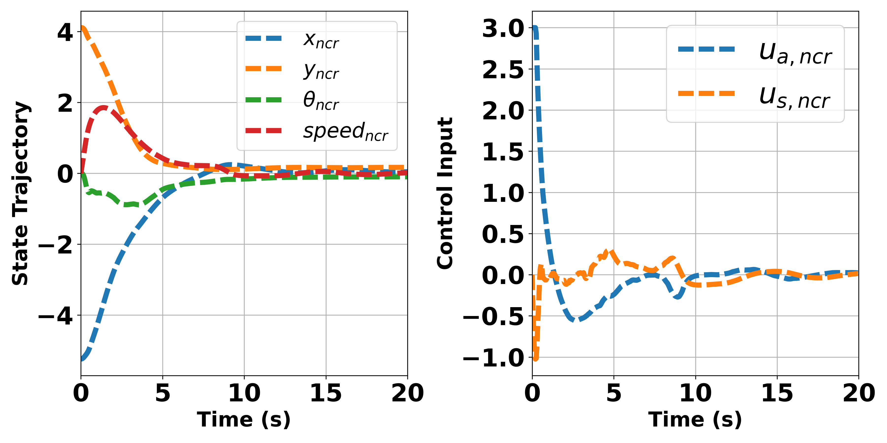
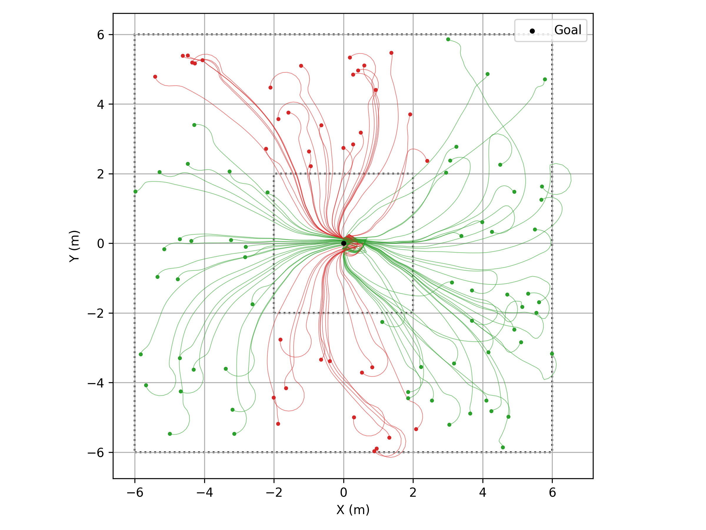
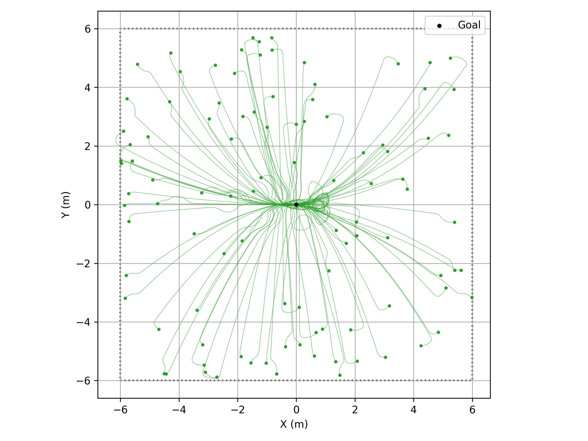

# Neural Co-state Regulator Implementation on Bicycle Model

This repository contains the bicycle-model implementation of a Neural Co-state Regulator (NCR) workflow. The code trains a Co-state Neural Network (CoNN) to approximate optimal co-state trajectories, then uses the learned co-states to compute real-time control inputs for a bicycle model with input constraints.

This work is related to the paper **"Neural Co-state Regulator: A Data-Driven Paradigm for Real-time Optimal Control with Input Constraints"**, published at CDC 2025. More information about the original project can be found on the [project website](https://lihanlian.github.io/neural_co-state_regulator/).

## Bicycle Model

This repository uses a four-state bicycle model with state

$$
q = [x, y, \theta, v]^T
$$

and the control input

$$
u = [u_a, u_s]^T,
$$

where $u_a = a$ is the longitudinal acceleration and $u_s = \frac{l_r}{L}\tan\delta$ is the transformed form of steering input $\delta$. Here, L is the wheelbase and $l_r$ is the distance from the state position (x,y) to the rear axle. 

The continuous-time dynamics are

```math
\begin{bmatrix}
\dot{x} \\
\dot{y} \\
\dot{\theta} \\
\dot{v}
\end{bmatrix}
=
\begin{bmatrix}
v\cos\theta \\
v\sin\theta \\
0 \\
0
\end{bmatrix}
+
\begin{bmatrix}
0 & -v\sin\theta \\
0 & v\cos\theta \\
0 & \frac{v}{l_r} \\
1 & 0
\end{bmatrix}
\begin{bmatrix}
u_a \\
u_s
\end{bmatrix}.
```

## Structure

- `config_template.py`  
  Template configuration file.

- `config.py`  
  Local experiment configuration. This file controls sampling time, prediction horizon, training epochs, cost weights, input constraints, initial states, and simulation settings.

- `bi_train.py`  
  Trains the Co-state Neural Network for the bicycle model.

- `bi_sim_ncr.py`  
  Runs NCR simulation using a trained checkpoint.

- `bi_mpc.py`  
  Defines and runs the bicycle Model Predictive Control baseline.

- `bi_mpc_rnd_traj_sim.py`  
  Runs MPC simulations over sampled/random initial conditions.

- `bi_ncr_rnd_traj_sim.py`  
  Runs NCR simulations over sampled/random initial conditions.

- `bi_utils.py`  
  Shared utility functions for bicycle dynamics, RK4 integration, QP solving, CBF constraints, plotting, and animation.

- `run.py`  
  Windows helper script that runs both training and simulation.

- `run_cont.py`  
  Windows helper script that continues training from a previous checkpoint, then runs NCR simulation.

## Results

**NCR Case B: Seen initial conditions and zero reference**
<p align="center">
  <br>
  <strong>Figure 1. NCR Case B state trajectory and control inputs.</strong>
</p>
<p align="center">
  <br>
  <strong>Figure 2. NCR Case B state and co-state animation.</strong>
</p>

**Visualization of bicycle animation**<br>
[Download/view bicycle trajectory animation](bi_animation/bicycle/bi_robot_animation_ncr_N100_b.mp4)


**Batch simulation comparison between NCR and MPC**
<table>
  <tr>
    <td align="center" width="50%">
      <br>
      <strong>Figure 3. NCR batch simulation.</strong>
    </td>
    <td align="center" width="50%">
      <br>
      <strong>Figure 4. MPC batch simulation.</strong>
    </td>
  </tr>
</table>

## Setup

Clone the project and go to project directory
```bash
  python3 -m venv env && source env/bin/activate 
```
```bash
  pip install -r requirements.txt
```
## License

[MIT](./LICENSE)
